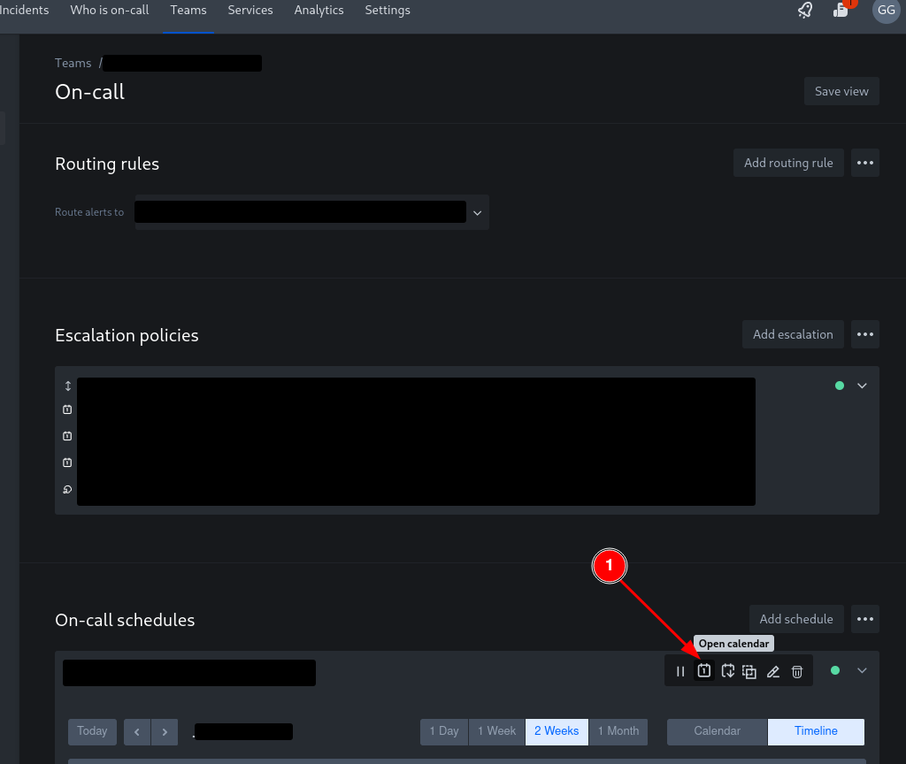
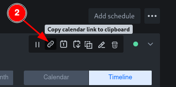
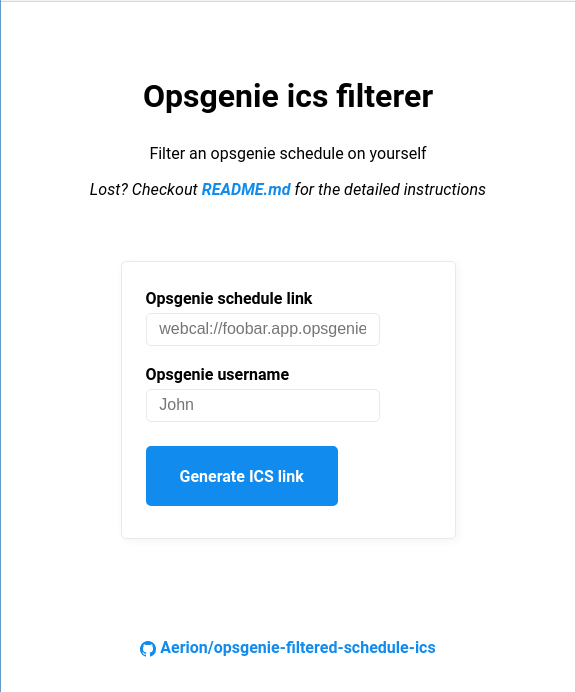
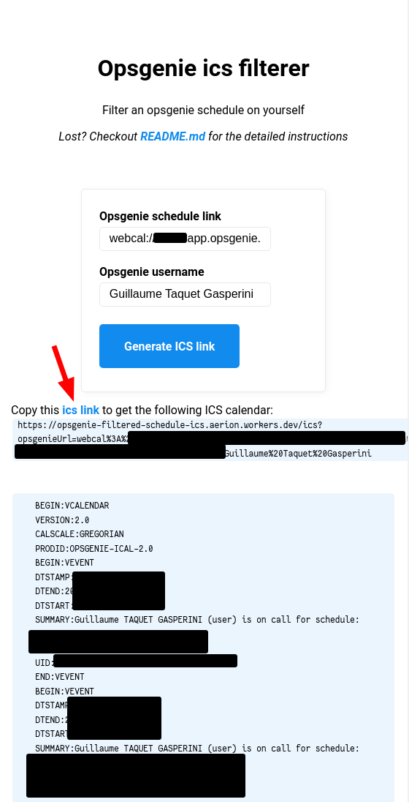

# Opsgenie Filtered Schedule ICS

Provides a way to filter on the opsgenie calendar to return the ics for a specific user, on a specific schedule.

## Context

### Could this be useful to you?

This could be useful to you if all of the following apply:

- You're using opsgenie
- You're on different opsgenie schedules
- You're not interested in your scheduling for at least one of your schedule
- You're interested in having an ICS for a specific schedule

### What does Opsgenie provide?

Out of the box, Opsgenie provides an ics:

- Per schedule (so with your other team-members)
- For yourself (including all of your schedules)

Thus, this tool is only useful if you'd like **your** rotation for a **single** schedule.

## How-to use it

### Online

1. Go to your opsgenie schedule page and click on the `Open calendar` button

   

2. Discard the pop-up, and now a new button appeared: click on the `Copy calendar link to clipboard` button

   

3. Go to [https://opsgenie-filtered-schedule-ics.aerion.workers.dev/](https://opsgenie-filtered-schedule-ics.aerion.workers.dev/)
4. Paste the opsgenie link from your clipboard and hit `Generate ICS link`

   

5. Copy and import the resulting `/ics` link given into your calendar, you can see a preview of the generated ics calendar

   

### Host-it yourself

Use [wrangler](https://developers.cloudflare.com/workers/wrangler/) to build and publish this to a cloudflare worker.
